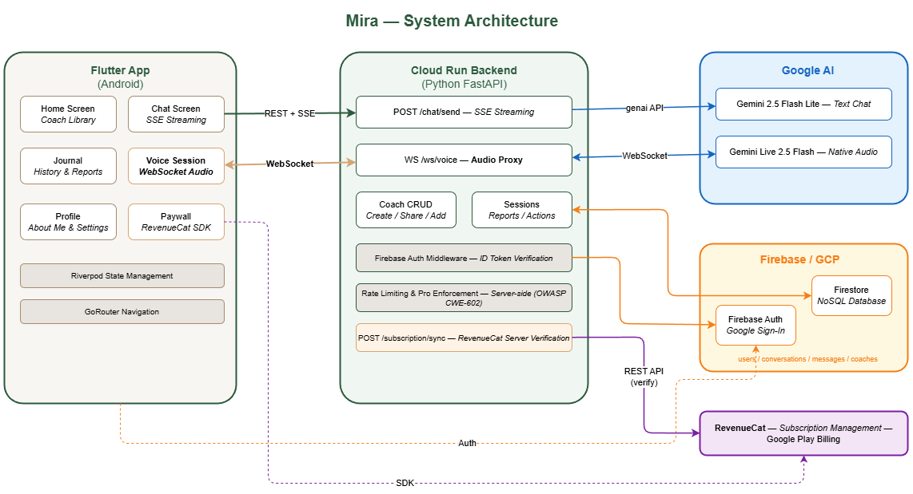

# Mira — Technical Documentation

> Shipyard 2026 Hackathon | Better Creating Brief

---

## Requirement Source and My Position

### 1. Influencer Requirements (from Simon's brief)

- Calm, intentional coaching UX that feels approachable
- Mobile-first accessibility with low setup friction
- Multiple coaching modes and support for personal context
- Session continuity and clear post-session outcomes
- Path from free trial to sustainable paid experience
- Original prompts/instructions (no AgentOS extraction)

### 2. My Interpretation and Agreement

I agreed with the brief's core premise: delivery and framing matter as much as model capability.
So I chose technical decisions that keep the product simple on the surface while maintaining production-grade reliability behind the scenes.

### 3. My Technical Decisions from That Direction

- Server-side enforcement for all premium features (not UI-only gating)
- Real-time voice architecture via Cloud Run WebSocket proxy to Gemini Live
- Lightweight personal context model ("About Me") injected into prompts
- Session report generation to ensure each conversation ends with clear takeaways
- RevenueCat server verification to support reliable subscription monetization

---

## System Architecture



> Source: [architecture.drawio](architecture.drawio)

Mira follows a **client–server architecture** with clear separation of concerns:

- **Flutter client** handles UI, navigation, and local state
- **Cloud Run backend** handles all AI interactions, business logic, and data persistence
- **No secrets in the client** — all API keys and service credentials live on the server

```
Flutter App (Android)
  ├─ REST + SSE → Cloud Run Backend → Gemini 2.5 Flash Lite (text)
  ├─ WebSocket  → Cloud Run Backend → Gemini Live 2.5 Flash Native Audio (voice)
  ├─ Firebase Auth (Google Sign-In)
  └─ RevenueCat SDK → Google Play Billing
```

---

## Tech Stack

### Frontend

| Technology | Purpose |
|---|---|
| **Flutter 3.x (Dart)** | Cross-platform UI framework (Android first) |
| **Riverpod** | State management (providers for auth, coaches, chat, subscriptions) |
| **GoRouter** | Declarative navigation with deep link support |
| **RevenueCat SDK** (`purchases_flutter 9.11.0`) | Subscription management and paywall UI |
| **Firebase Auth** (`firebase_auth`) | Google Sign-In authentication |
| **Cloud Firestore** (`cloud_firestore`) | Real-time data sync (read-only on client) |
| **http** package | REST API calls with SSE streaming |
| **web_socket_channel** | WebSocket connection for voice sessions |
| **permission_handler** | Microphone permission for voice |
| **uuid** | Conversation ID generation |

### Backend

| Technology | Purpose |
|---|---|
| **Python 3.11+ / FastAPI** | High-performance async API server |
| **Google Cloud Run** | Serverless container hosting (auto-scales to zero) |
| **google-genai** | Direct Gemini API client (text generation) |
| **websockets** | Gemini Live bidirectional audio proxy |
| **sse-starlette** | Server-Sent Events for streaming chat responses |
| **firebase-admin** | Firestore writes + Firebase Auth token verification |
| **httpx** | Async HTTP client (RevenueCat server-side verification) |
| **structlog** | Structured JSON logging for Cloud Logging |

### Infrastructure

| Service | Purpose |
|---|---|
| **Google Cloud Run** | Backend hosting (region: us-central1) |
| **Cloud Firestore** | NoSQL database for all app data |
| **Firebase Authentication** | User identity (Google Sign-In provider) |
| **Google Gemini 2.5 Flash Lite** | Text chat AI model (region: global) |
| **Google Gemini Live 2.5 Flash Native Audio** | Real-time voice AI model (region: us-central1) |
| **RevenueCat** | Subscription lifecycle management |
| **Google Play Billing** | Payment processing |
| **GCP Project** | `surveydxplatform` |

---

## AI Models

### Text Chat: Gemini 2.5 Flash Lite

- **Use case:** All text-based coaching conversations
- **Access:** Direct `genai.Client` API via Vertex AI (`GOOGLE_GENAI_USE_VERTEXAI=1`)
- **Region:** `us-central1`
- **Streaming:** Server generates tokens → SSE stream to client
- **System prompt:** Coach-specific persona + user's About Me context + coaching methodology

### Voice Coaching: Gemini Live 2.5 Flash Native Audio

- **Use case:** Real-time bidirectional voice coaching sessions
- **Access:** WebSocket connection through Cloud Run proxy
- **Region:** `us-central1`
- **Audio format:** PCM 16-bit, 16kHz mono
- **Architecture:** Flutter captures mic audio → WebSocket to Cloud Run → WebSocket to Gemini Live → audio response back through same path
- **Timeout:** Cloud Run configured with `--timeout=3600s` (default 15 min is insufficient for voice sessions)

---

## Data Architecture (Firestore)

```
users/{uid}
  ├─ profile/data           → { displayName, aboutMe, createdAt }
  ├─ subscription/data      → { plan, freeVoiceTrialUsed, dailyMessageCount, lastMessageDate }
  ├─ about_me/data          → { freeText, updatedAt }
  └─ coach_library/{coachId}→ { addedAt }

conversations/{convId}      → { metadata: { userId, coachId, coachName, type, title, ... }, report: { ... } }
  └─ messages/{msgId}       → { role, content, timestamp }

coaches/{coachId}           → { name, focus, style, systemPrompt, creatorId, shareCode, isBuiltIn, usageCount }

voice_usage/{uid}           → { monthlyMinutes, sessions[], month }
```

**Key design decisions:**
- **Conversations are top-level** — filtered by `metadata.userId`, not nested under `users/{uid}` (enables efficient server-side queries)
- **Client is read-only** — All writes go through the backend (except About Me for UX responsiveness)
- **Security rules** enforce user isolation — users can only read their own data via `metadata.userId` check
- **Coach sharing uses `shareCode` field** within the `coaches` collection, queried with `.where("shareCode", "==", code)` — no separate lookup collection needed
- **Messages are subcollections** of conversations for efficient pagination
- **Reports are embedded** in the conversation document (not a subcollection) and generated on-demand

---

## Authentication Flow

```
1. User taps "Sign in with Google"
2. Flutter Firebase Auth SDK → Google Sign-In → Firebase ID token
3. Flutter sends ID token in Authorization header on every API call
4. Backend verifies token with Firebase Admin SDK
5. Backend extracts uid, creates/updates user profile in Firestore
6. All subsequent requests authenticated via the same token
```

**Auth middleware** (`get_current_user` dependency in FastAPI) runs on every endpoint. Unauthenticated requests receive HTTP 401.

---

## RevenueCat Implementation

### Why RevenueCat

- Abstracts Google Play Billing complexity (purchase flows, receipt validation, subscription lifecycle)
- Provides server-side subscription verification API
- Handles edge cases: renewals, cancellations, grace periods, billing retries
- Dashboard for revenue analytics and cohort tracking

### Client-Side (Flutter)

```dart
// Initialization (on app start)
await Purchases.configure(PurchasesConfiguration(revenueCatApiKey));
await Purchases.logIn(firebaseUser.uid);

// Purchase flow
final offerings = await Purchases.getOfferings();
final package = offerings.current!.monthly!;  // or .annual
await Purchases.purchasePackage(package);

// After successful purchase → sync to backend
await apiService.syncSubscription();
```

**Offerings:**
- `pro_monthly` — $9.99/month
- `pro_annual` — $79.99/year (BEST VALUE)

### Server-Side Verification

**Critical design principle: Never trust client claims about subscription status.**

The Flutter client calls `POST /subscription/sync` after every purchase or restore. The backend then:

1. Calls RevenueCat REST API (`GET /v1/subscribers/{uid}`) with the secret API key
2. Checks for active `pro` entitlement
3. Writes verified plan status to Firestore (`users/{uid}/subscription/data`)
4. Returns confirmed plan to client

```python
# Server-side verification (simplified)
async with httpx.AsyncClient() as client:
    resp = await client.get(
        f"https://api.revenuecat.com/v1/subscribers/{user.uid}",
        headers={"Authorization": f"Bearer {REVENUECAT_SECRET_KEY}"},
    )
subscriber = resp.json()["subscriber"]
is_pro = "pro" in subscriber["entitlements"]
await firestore.update_subscription(user.uid, "pro" if is_pro else "free")
```

### Server-Side Enforcement

Every premium feature is enforced on the backend — frontend checks are UI-only:

| Feature | Free | Pro | Enforcement |
|---|---|---|---|
| Text chat | 10 msg/day, Mira only | Unlimited, all coaches | HTTP 429 (rate limit) / HTTP 403 (pro coach) |
| Voice coaching | 1x 5-min trial | 60 min/month, 30 min/session | WebSocket error + close |
| Custom coaches | — | Create & share | HTTP 403 |
| Session reports | Available (4+ messages) | Available | Ownership check only |

**Pro coach enforcement:**
```python
PRO_COACHES = {'atlas', 'lyra', 'sol', 'ember'}
if user.plan != "pro":
    if request.coach_id in PRO_COACHES or not is_built_in(request.coach_id):
        raise HTTPException(status_code=403, detail="Pro subscription required")
```

---

## API Endpoints

### Chat

| Method | Path | Description |
|---|---|---|
| `POST` | `/chat/send` | Send message, receive SSE stream of coach response |

### Sessions

| Method | Path | Description |
|---|---|---|
| `GET` | `/conversations` | List user's conversations (paginated) |
| `GET` | `/conversations/{id}/messages` | Get messages for a conversation |
| `DELETE` | `/conversations/{id}` | Delete a conversation |
| `POST` | `/conversations/{id}/report` | Generate session report (on-demand, 4+ messages required) |
| `PATCH` | `/conversations/{id}/action-status` | Update action item status |

### Voice

| Method | Path | Description |
|---|---|---|
| `WebSocket` | `/ws/voice/{conversation_id}` | Bidirectional audio streaming session |

### Coaches

| Method | Path | Description |
|---|---|---|
| `GET` | `/coaches/mine` | List user's custom + added coaches |
| `POST` | `/coaches/create` | Create custom coach (Pro only) |
| `GET` | `/coaches/shared/{share_code}` | Get shared coach info by code |
| `POST` | `/coaches/add/{share_code}` | Add shared coach to library (Pro only) |

### Profile

| Method | Path | Description |
|---|---|---|
| `GET` | `/profile` | Get user profile (includes usage stats) |
| `PUT` | `/profile/about-me` | Update About Me text |
| `PUT` | `/profile/display-name` | Update display name |
| `POST` | `/profile/subscription/sync` | Verify subscription with RevenueCat and sync to Firestore |

---

## Security Considerations

1. **No secrets in client** — All API keys (Gemini, RevenueCat secret, Firebase service account) exist only on Cloud Run as environment variables
2. **Server-side enforcement** (OWASP CWE-602) — Every premium feature returns HTTP 403 on the backend, not just a UI block
3. **Firebase Auth token verification** — Every API request is authenticated; tokens are verified server-side with Firebase Admin SDK
4. **Firestore security rules** — Users can only read their own data; all writes go through the backend
5. **RevenueCat server verification** — Subscription status is verified server-to-server, never trusting client-reported purchase state
6. **Ownership checks** — Conversation and coach access verified against `owner_id` (handles `None` and empty string edge cases)

---

## Deployment

### Backend (Cloud Run)

```bash
gcloud run deploy mira-backend \
  --source backend/ \
  --region us-central1 \
  --project surveydxplatform \
  --allow-unauthenticated \
  --timeout=3600s \
  --set-env-vars="GOOGLE_CLOUD_LOCATION=global,GOOGLE_GENAI_USE_VERTEXAI=1,..."
```

Key configuration:
- `--timeout=3600s` — Required for WebSocket voice sessions (default 15 min is insufficient)
- `--allow-unauthenticated` — Cloud Run accepts all traffic; auth is handled at the application layer via Firebase tokens

### Frontend (Flutter APK)

```bash
cd app
flutter build apk --release
# Upload to Google Play Internal Testing track
```

---

*Built for Shipyard 2026 Hackathon — Better Creating Brief*
